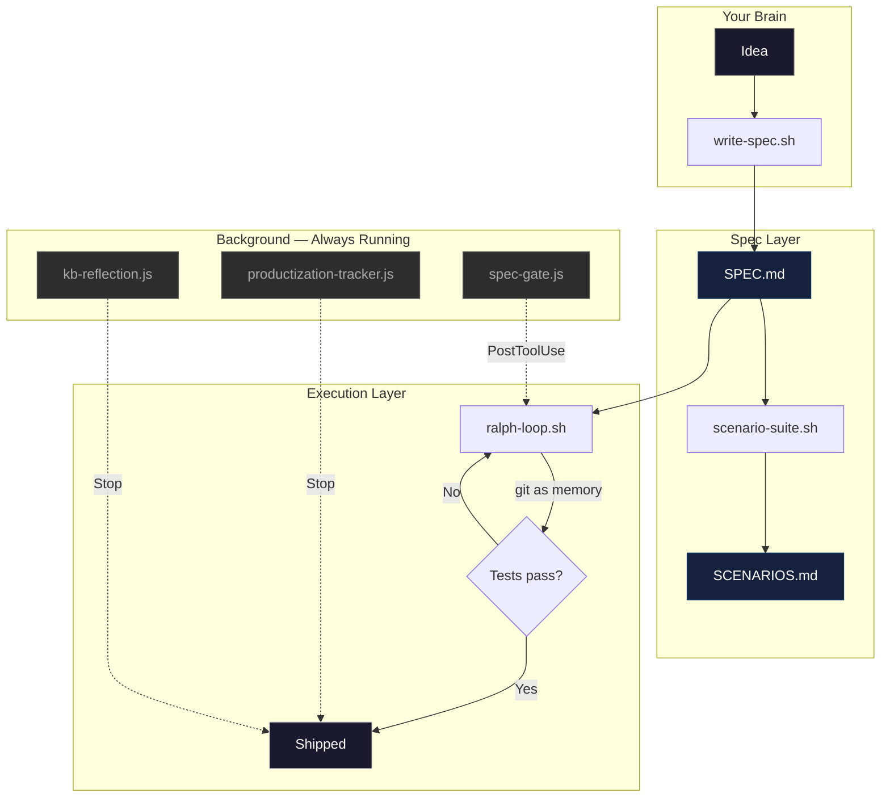
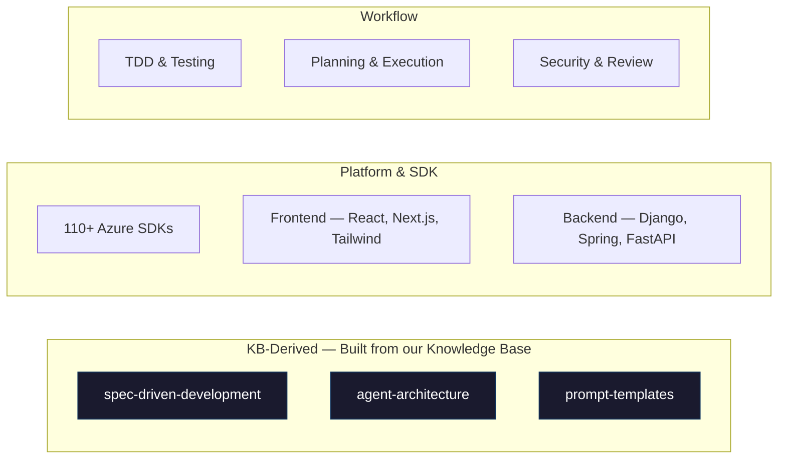

<p align="center">
  
</p>

<h1 align="center">EliteX Skill Library</h1>

<p align="center">
  <em>Strategy meets execution. Knowledge meets code.</em><br/>
  <sub>The complete Claude Code toolkit for EliteX workstations.</sub>
</p>

<p align="center">
  
  
  
  
</p>

---

## The Idea

We processed hundreds of hours of research on AI-native building, distilled it into 32 named frameworks, and turned all of it into something Claude Code can actually use — skills that fire automatically, hooks that watch your back, scripts that bridge the gap between "I have an idea" and "it's shipped."

This repo is the single source of truth. Clone it on a new machine, run the installer, and your entire workflow drops in. Every skill, every hook, every command — synced.

The yin-yang isn't just a logo. It's how this works: **strategy and tactics, thinking and doing, spec and code** — always in balance.

---

## How It Fits Together



---

## What's In The Box

### Skills — 222 of them

Skills are markdown files that Claude loads automatically when it detects you're working in a relevant context. You don't invoke them. They just show up when you need them.



The three we built from the Knowledge Base are the ones that matter most:

| Skill | What It Actually Does |
|:------|:---------------------|
| **spec-driven-development** | Stops you from coding before you think. Forces a SPEC.md with success criteria, behavioral scenarios, and explicit scope boundaries. Based on the insight that *the bottleneck moved from code to specification* — building the wrong thing fast is worse than building nothing. |
| **agent-architecture** | When you're building any AI agent or automation, this skill enforces one rule: agents make decisions, tools do work. Default to one agent. Only add more if tasks are truly independent. Research proves more agents usually makes things worse. |
| **prompt-templates** | Three battle-tested prompt structures — Short (extraction), Long (generation), Agent (decision-making) — with a selection matrix telling you which to use when. Includes the Notes section trick that exploits how LLMs weight the end of prompts more heavily. |

### Hooks — 5 watchers

Hooks run in the background. You never touch them. They fire on lifecycle events.

| Hook | When | What It Does For You |
|:-----|:-----|:---------------------|
| `spec-gate.js` | Every time Claude writes a code file | Checks if SPEC.md exists. If not, you get a nudge. If it does, silence. Keeps you honest. |
| `productization-tracker.js` | End of every session | Logs what you built — date, project, description — to a simple text file. After a few weeks, patterns emerge. Anything you've built 3+ times is a productization candidate. |
| `kb-reflection.js` | End of every session | Captures completion summaries into the Knowledge Base. Your work feeds back into your knowledge. |
| `gsd-check-update.js` | Session start | Initializes GSD mode. Sets the tone. |
| `gsd-statusline.js` | Always | Status bar context while you work. |

### Scripts — 4 tools you run yourself

These are the only things you invoke manually. They're the bridges between phases of work.

| Script | When You'd Use It |
|:-------|:------------------|
| `write-spec.sh "build a chatbot for hotels"` | You have an idea but no spec. This runs Claude in conversation mode and produces a structured SPEC.md with success criteria, scenarios, architecture, and scope. |
| `scenario-suite.sh` | You have a spec and want a quality gate. This generates behavioral scenarios from the *outside* — what a user would see, not how the code works. The agent can't game these during development. |
| `ralph-loop.sh SPEC.md 10` | You have a spec, you have scenarios, and you want Claude to build it autonomously. This loops: run Claude, check tests, commit progress, retry with fresh context. Git is the memory. |
| `kb-ingest.sh` | You have new research content to feed into the Knowledge Base. |

### Commands — 67 slash commands

Type these directly in Claude Code. The big ones:

| Command | What Happens |
|:--------|:-------------|
| `/kb pricing strategies` | Searches the Knowledge Base and synthesizes relevant frameworks, insights, and actionable ideas |
| `/brainstorm hotel tech` | Deep brainstorm using 8-10+ KB notes, cross-referenced against all six EliteX ventures |
| `/scope-project "AI chatbot for dental clinics"` | Full project scope with pricing options, ROI estimate, timeline, and tool stack |
| `/blog-from-kb ai automation` | Generates an 800-1200 word blog article for elite-x.tech, grounded in KB data |
| `/obsidian` | Activates vault mode — all research auto-writes to Obsidian |
| `/gsd-new-project` | Kicks off a structured project with milestones and phases |

---

## The Knowledge Behind It

Everything in this repo traces back to the EliteX Knowledge Base — 136 structured research notes distilled into 32 named frameworks.

```mermaid
graph TD
    subgraph "EliteX KB — Strategic Frameworks"
        N1["Specification Bottleneck"]
        N2["5 Levels of AI Coding"]
        N3["Ralph Pattern"]
        N4["Scenarios vs Tests"]
        N5["Multi-Agent Failure Patterns"]
        N6["Phronesis — Practical Wisdom"]
        N7["Builder Operating System 2026"]
    end

    subgraph "EliteX KB — Tactical Frameworks"
        B1["Three-Stage Pricing"]
        B2["Agent Responsibility Minimization"]
        B3["Prompt Engineering Frameworks"]
        B4["Productized AI System Model"]
        B5["Agency Scaling Roadmap"]
    end

    N1 --> SK["spec-driven-development skill"]
    N2 --> SK
    N4 --> SC["scenario-suite.sh script"]
    N3 --> RL["ralph-loop.sh script"]
    N5 --> AG["agent-architecture skill"]
    N6 --> AG
    B2 --> AG
    B3 --> PT["prompt-templates skill"]
    B4 --> TR["productization-tracker.js hook"]
    N1 --> SG["spec-gate.js hook"]

    style SK fill:#1a1a2e,stroke:#0f3460,color:#fff
    style AG fill:#1a1a2e,stroke:#0f3460,color:#fff
    style PT fill:#1a1a2e,stroke:#0f3460,color:#fff
    style SC fill:#16213e,stroke:#555,color:#ccc
    style RL fill:#16213e,stroke:#555,color:#ccc
    style SG fill:#2d2d2d,stroke:#555,color:#aaa
    style TR fill:#2d2d2d,stroke:#555,color:#aaa
```



---

## Install

One line. Any machine.

```bash
curl -sSL https://raw.githubusercontent.com/Elit3-X/elitex-skill-library/main/install.sh | bash
```

Or do it by hand:

```bash
git clone https://github.com/Elit3-X/elitex-skill-library.git
cd elitex-skill-library

cp -R skills/* ~/.claude/skills/
cp hooks/* ~/.claude/hooks/
cp scripts/* ~/.claude/scripts/ && chmod +x ~/.claude/scripts/*.sh
cp commands/*.md ~/.claude/commands/
cp -R commands/gsd ~/.claude/commands/gsd

# Review these before overwriting your own
cp CLAUDE.md ~/.claude/CLAUDE.md
cp settings.json.example ~/.claude/settings.json
```

Restart Claude Code. Done.

---

## Sync Back

Made changes locally? Push them back so every workstation stays in sync.

```bash
cd /path/to/elitex-skill-library

cp -R ~/.claude/skills/* skills/
cp ~/.claude/hooks/*.js hooks/
cp ~/.claude/scripts/*.sh scripts/
cp ~/.claude/commands/*.md commands/
cp -R ~/.claude/commands/gsd commands/gsd
cp ~/.claude/CLAUDE.md CLAUDE.md
cp ~/.claude/settings.json settings.json.example

git add -A && git commit -m "sync from $(hostname)" && git push
```

---

## The Balance

The yin-yang isn't decoration. It's the operating philosophy:

| | Strategy (Yin) | Execution (Yang) |
|:--|:---------------|:-----------------|
| **Source** | EliteX KB — frameworks, theory, market intelligence | EliteX KB — builds, templates, step-by-step systems |
| **Artifact** | SPEC.md, SCENARIOS.md | Code, commits, shipped product |
| **Mode** | Colleague-shaped AI (explore, clarify, question) | Tool-shaped AI (execute, iterate, ship) |
| **Skill** | spec-driven-development | ralph-loop, prompt-templates |
| **Metric** | Spec quality, scenario coverage | Tests passing, iteration speed |

Neither side works without the other. Spec without execution is a document. Execution without spec is waste at speed.

---

<p align="center">
  <sub>EliteX GbR — Aichach, Germany</sub><br/>
  <sub>Built by Vaisakhan Sanu & Chris Zanfir</sub>
</p>
