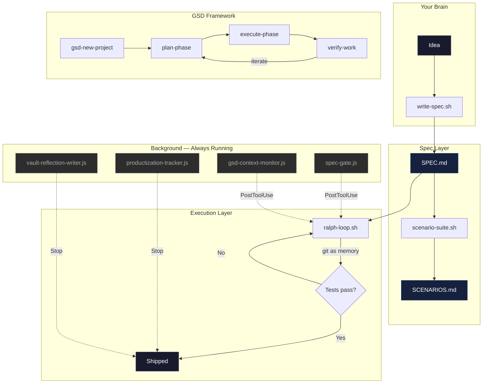
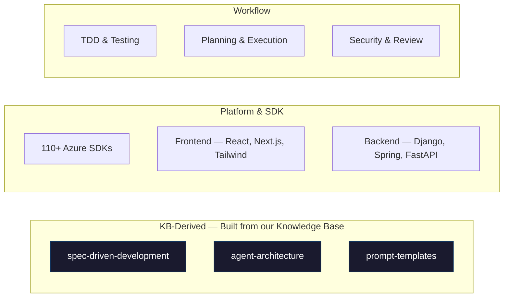

```mermaid
graph TD
    subgraph "EliteX KB — Strategic Frameworks"
        N1["Specification Bottleneck"]
        N2["5 Levels of AI Coding"]
        N3["Ralph Pattern"]
        N4["Scenarios vs Tests"]
        N5["Multi-Agent Failure Patterns"]
        N6["Phronesis — Practical Wisdom"]
        N7["Builder Operating System 2026"]
    end

    subgraph "EliteX KB — Tactical Frameworks"
        B1["Three-Stage Pricing"]
        B2["Agent Responsibility Minimization"]
        B3["Prompt Engineering Frameworks"]
        B4["Productized AI System Model"]
        B5["Agency Scaling Roadmap"]
    end

    N1 --> SK["spec-driven-development skill"]
    N2 --> SK
    N4 --> SC["scenario-suite.sh script"]
    N3 --> RL["ralph-loop.sh script"]
    N5 --> AG["agent-architecture skill"]
    N6 --> AG
    B2 --> AG
    B3 --> PT["prompt-templates skill"]
    B4 --> TR["productization-tracker.js hook"]
    N1 --> SG["spec-gate.js hook"]

    style SK fill:#1a1a2e,stroke:#0f3460,color:#fff
    style AG fill:#1a1a2e,stroke:#0f3460,color:#fff
    style PT fill:#1a1a2e,stroke:#0f3460,color:#fff
    style SC fill:#16213e,stroke:#555,color:#ccc
    style RL fill:#16213e,stroke:#555,color:#ccc
    style SG fill:#2d2d2d,stroke:#555,color:#aaa
    style TR fill:#2d2d2d,stroke:#555,color:#aaa
```

<p align="center">
  
</p>

<h1 align="center">EliteX Skill Library</h1>

<p align="center">
  <em>Strategy meets execution. Knowledge meets code.</em><br/>
  <sub>The complete Claude Code toolkit for EliteX workstations.</sub>
</p>

<p align="center">
  
  
  
  
  
  
</p>

---

## The Idea

We processed hundreds of hours of research on AI-native building, distilled it into 32 named frameworks, and turned all of it into something Claude Code can actually use — skills that fire automatically, hooks that watch your back, scripts that bridge the gap between "I have an idea" and "it's shipped."

This repo is the single source of truth. Clone it on a new machine, run the installer, and your entire workflow drops in. Every skill, every hook, every command — synced.

The yin-yang isn't just a logo. It's how this works: **strategy and tactics, thinking and doing, spec and code** — always in balance.

---

## How It Fits Together



---

## What's In The Box

### Skills — 225

Skills are markdown files that Claude loads automatically when it detects you're working in a relevant context. You don't invoke them. They just show up when you need them.



The three we built from the Knowledge Base are the ones that matter most:

| Skill | What It Actually Does |
|:------|:---------------------|
| **spec-driven-development** | Stops you from coding before you think. Forces a SPEC.md with success criteria, behavioral scenarios, and explicit scope boundaries. Based on the insight that *the bottleneck moved from code to specification* — building the wrong thing fast is worse than building nothing. |
| **agent-architecture** | When you're building any AI agent or automation, this skill enforces one rule: agents make decisions, tools do work. Default to one agent. Only add more if tasks are truly independent. Research proves more agents usually makes things worse. |
| **prompt-templates** | Three battle-tested prompt structures — Short (extraction), Long (generation), Agent (decision-making) — with a selection matrix telling you which to use when. Includes the Notes section trick that exploits how LLMs weight the end of prompts more heavily. |

### Agents — 12 specialized subagents

Agent definitions for the GSD framework. Each agent has a focused role and can be spawned in parallel.

| Agent | Role |
|:------|:-----|
| `gsd-planner` | Creates executable phase plans with task breakdown and dependency analysis |
| `gsd-executor` | Executes plans with atomic commits, deviation handling, and checkpoints |
| `gsd-debugger` | Investigates bugs using scientific method, manages debug sessions |
| `gsd-verifier` | Verifies phase goal achievement through goal-backward analysis |
| `gsd-codebase-mapper` | Explores codebase and writes structured analysis documents |
| `gsd-roadmapper` | Creates project roadmaps with phase breakdown and requirement mapping |
| `gsd-phase-researcher` | Researches how to implement a phase before planning |
| `gsd-project-researcher` | Researches domain ecosystem before roadmap creation |
| `gsd-research-synthesizer` | Synthesizes research outputs from parallel researcher agents |
| `gsd-plan-checker` | Verifies plans will achieve phase goal before execution |
| `gsd-integration-checker` | Verifies cross-phase integration and E2E flows |
| `gsd-nyquist-auditor` | Fills validation gaps by generating tests and verifying coverage |

### GSD Framework — Get Shit Done

A full project management framework built into Claude Code. 34 workflows, 36 templates, 13 reference docs.

```
get-shit-done/
├── bin/           # CLI tooling (gsd-tools.cjs + lib/)
├── references/    # Model profiles, git integration, TDD, verification patterns
├── templates/     # Project, milestone, phase, debug, research templates
└── workflows/     # 34 executable workflow definitions
```

Key workflows: `new-project` → `plan-phase` → `execute-phase` → `verify-work` → `complete-milestone`

### Hooks — 10 watchers

Hooks run in the background. You never touch them. They fire on lifecycle events.

| Hook | When | What It Does |
|:-----|:-----|:-------------|
| `spec-gate.js` | PostToolUse (Write) | Checks if SPEC.md exists before writing code |
| `productization-tracker.js` | Stop | Logs what you built — patterns emerge after weeks |
| `kb-reflection.js` | Stop | Captures session summaries into the Knowledge Base |
| `vault-reflection-writer.js` | Stop | Auto-writes Obsidian vault notes after significant work |
| `vault-index-builder.js` | SessionStart | Rebuilds vault index for mid-session queries |
| `vault-context-loader.js` | SessionStart | Loads project-relevant vault notes into context |
| `handoff-resume-loader.js` | SessionStart | Loads handoff state for seamless session continuity |
| `gsd-context-monitor.js` | PostToolUse | Monitors context exhaustion, triggers auto-handoff |
| `gsd-check-update.js` | SessionStart | Initializes GSD mode |
| `gsd-statusline.js` | Always | Status bar context while you work |

### Scripts — 9 tools you run yourself

| Script | When You'd Use It |
|:-------|:------------------|
| `write-spec.sh "build a chatbot"` | Produces a structured SPEC.md with success criteria, scenarios, architecture |
| `scenario-suite.sh` | Generates behavioral scenarios from the outside — the agent can't game these |
| `ralph-loop.sh SPEC.md 10` | Autonomous build loop: run Claude, check tests, commit, retry with fresh context |
| `kb-ingest.sh` | Feed new research content into the Knowledge Base |
| `infinite-agent.sh` | Long-running autonomous agent with handoff and resume support |
| `debug-loop.sh` | Iterative debugging with scientific method and checkpoints |
| `bw-auto-unlock.sh` | Bitwarden auto-unlock via macOS Keychain |
| `obsidian-sync.sh` | Sync vault index and session context |
| `obsidian-watch.sh` | Watch for vault changes and trigger syncs |

### Commands — 71 slash commands

Type these directly in Claude Code. The big ones:

| Command | What Happens |
|:--------|:-------------|
| `/kb pricing strategies` | Searches the Knowledge Base and synthesizes relevant frameworks |
| `/brainstorm hotel tech` | Deep brainstorm using 8-10+ KB notes, cross-referenced against ventures |
| `/scope-project "AI chatbot"` | Full project scope with pricing, ROI, timeline, and tool stack |
| `/blog-from-kb ai automation` | 800-1200 word blog article grounded in KB data |
| `/obsidian` | Activates vault mode — all research auto-writes to Obsidian |
| `/vault-query <topic>` | Search vault notes by keyword, returns top matches with backlinks |
| `/vault-sync` | Update MEMORY.md pointers from current vault state |
| `/get-secret <name>` | Quick credential lookup from Bitwarden |
| `/gsd-new-project` | Kicks off a structured project with milestones and phases |
| `/gsd-plan-phase` | Create detailed execution plan for a phase |
| `/gsd-execute-phase` | Execute all plans in a phase |
| `/gsd-verify-work` | Validate built features against phase goals |
| `/gsd-debug` | Systematic debugging with scientific method |

### Teams — 7 saved team configs

Reusable multi-agent team configurations for different project types.

| Team | Purpose |
|:-----|:--------|
| `kaufdahoam-finalize` | 8-agent audit & finalization swarm |
| `kriyaverse-migration` | Parallel research + planning + execution |
| `kriyaverse-ui-overhaul` | 4-agent UI component swarm |
| `testflight-fix-sprint` | 5-agent bug fix sprint |
| `obsidian-to-affine` | 6-worker migration pipeline |
| `logo-fix` | 3-agent asset pipeline |
| `theme-fix` | 3-agent theming swarm |

### Config Files

| File | Purpose |
|:-----|:--------|
| `CLAUDE.md` | Global instructions — GSD mode, auto-skills, vault integration, deployment rules |
| `settings.json.example` | Hooks, permissions, statusline, teams config |
| `mcp.json.example` | MCP server configuration (Apple Mail) |
| `.mcp.json.example` | Extended MCP config (Firebase, PostHog, Apple Mail) |
| `gsd-file-manifest.json` | GSD framework file registry |

---

## The Knowledge Behind It

Everything in this repo traces back to the EliteX Knowledge Base — 148 structured research notes distilled into 32 named frameworks.



---

## Install

One line. Any machine.

```bash
curl -sSL https://raw.githubusercontent.com/Elit3-X/elitex-skill-library/main/install.sh | bash
```

Or do it by hand:

```bash
git clone https://github.com/Elit3-X/elitex-skill-library.git
cd elitex-skill-library

# Core
cp -R skills/* ~/.claude/skills/
cp -R commands/* ~/.claude/commands/
cp hooks/* ~/.claude/hooks/
cp scripts/* ~/.claude/scripts/ && chmod +x ~/.claude/scripts/*.sh

# Agents & GSD
cp -R agents ~/.claude/agents/
cp -R get-shit-done ~/.claude/get-shit-done/

# Teams (optional — review before overwriting)
cp -R teams ~/.claude/teams/

# Config (review before overwriting your own)
cp CLAUDE.md ~/.claude/CLAUDE.md
cp settings.json.example ~/.claude/settings.json
cp mcp.json.example ~/.claude/mcp.json
```

Restart Claude Code. Done.

---

## Sync Back

Made changes locally? Push them back so every workstation stays in sync.

```bash
cd /path/to/elitex-skill-library

cp -R ~/.claude/skills/* skills/
cp -R ~/.claude/commands/* commands/
cp ~/.claude/hooks/*.js hooks/
cp ~/.claude/scripts/*.sh scripts/
cp -R ~/.claude/agents/* agents/
cp -R ~/.claude/get-shit-done/* get-shit-done/
cp ~/.claude/CLAUDE.md CLAUDE.md
cp ~/.claude/settings.json settings.json.example

git add -A && git commit -m "sync from $(hostname)" && git push
```

---

## The Balance

The yin-yang isn't decoration. It's the operating philosophy:

| | Strategy (Yin) | Execution (Yang) |
|:--|:---------------|:-----------------|
| **Source** | EliteX KB — frameworks, theory, market intelligence | EliteX KB — builds, templates, step-by-step systems |
| **Artifact** | SPEC.md, SCENARIOS.md | Code, commits, shipped product |
| **Mode** | Colleague-shaped AI (explore, clarify, question) | Tool-shaped AI (execute, iterate, ship) |
| **Skill** | spec-driven-development | ralph-loop, prompt-templates |
| **Metric** | Spec quality, scenario coverage | Tests passing, iteration speed |

Neither side works without the other. Spec without execution is a document. Execution without spec is waste at speed.

---

<p align="center">
  <sub>EliteX GbR — Aichach, Germany</sub><br/>
  <sub>Built by Vaisakhan Sanu & Chris Zanfir</sub>
</p>
